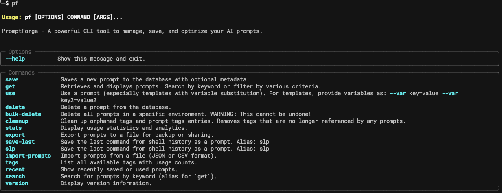
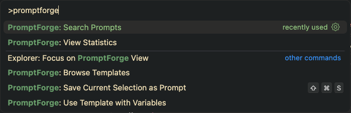

# 🔥 PromptForge - Official Releases

**Cross-Platform AI Prompt Management & Optimization**

[](https://opensource.org/licenses/MIT)
[](https://www.python.org/downloads/)
[](https://github.com/aki21j/promptforge-releases)

> **🚀 Professional AI prompt management for individuals and teams**  
> Save, organize, search, and optimize your AI prompts with powerful templates, analytics, and cross-platform integration.

## ⚡ Quick Install

### macOS/Linux
```bash
# Download from releases page and extract
tar -xzf promptforge-*.tar.gz
cd promptforge-*
./install.sh

# Or extract wheel and install directly
pip install --user promptforge-*.whl
```

### Windows
```powershell
# Extract zip file and run installer
# Or install wheel directly
pip install promptforge-*.whl
```

## 🌟 Features

- **🎯 Smart Prompt Management** - Save, search, and organize prompts with tags and ratings
- **🔧 Powerful Templates** - Create reusable templates with variables using Jinja2 syntax
- **📊 Analytics & Insights** - Track usage patterns and optimize your prompt effectiveness
- **🔄 Cross-Platform Sync** - CLI, VSCode/Cursor extension, and Claude Code MCP server
- **📱 Universal Access** - Works everywhere: terminal, IDE, and AI coding assistants
- **⚡ Lightning Fast** - Local SQLite database with instant search and retrieval
- **🛡️ Privacy First** - All data stored locally, no cloud dependencies

## 📸 See It In Action

### CLI Interface


### IDE Integration  


## 🚀 Quick Start

```bash
# Save your first prompt
pf save "Explain this code step by step" --title "Code Explainer" --tags coding

# Create a template with variables
pf save "Write a {{type}} about {{topic}} for {{audience}}" --title "Content Writer" --template

# Search and use prompts
pf search "code"
pf use 2 --var type=blog --var topic="AI tools" --var audience=developers

# View your prompt library
pf recent
pf tags --popular
pf stats
```

## 📦 What's Included

### 🖥️ CLI Tool (`pf` or `promptforge`)
- Full-featured prompt management
- Template system with variable substitution
- Import/export functionality
- Advanced search and filtering
- Usage analytics and statistics

### 🎨 VSCode/Cursor Extension
- Seamless integration with your editor
- Quick access to prompts via command palette
- Template insertion with variable prompts
- Syntax highlighting for prompt files

### 🤖 Claude Code MCP Server
- Natural language prompt management
- Integration with Claude Code workflows
- Automatic prompt suggestions
- Context-aware template recommendations

## 📋 Installation Options

### 🔥 All-in-One Installer (Recommended)
```bash
# Download latest release from GitHub releases page
# Extract and run installer
tar -xzf promptforge-*.tar.gz
cd promptforge-*
chmod +x install.sh
./install.sh
```

### 📦 Individual Components
```bash
# CLI only - extract wheel from release package
pip install --user promptforge-*.whl

# VSCode extension: Install .vsix file from release package
code --install-extension promptforge-*.vsix

# MCP server: Included in release package, see installation guide
```

## 🔧 Advanced Usage

### Templates with Variables
```bash
# Create advanced templates
pf save "Act as a {{role}} expert. {{task}} for {{context}}" --template --title "Expert Prompter"

# Use with multiple variables
pf use 5 --var role="Python developer" --var task="Review this code" --var context="production API"
```

### Batch Operations
```bash
# Export for backup
pf export my-prompts.json

# Import from backup
pf import my-prompts.json

# Environment management
pf save "Debug prompt" --env test
pf get --env prod
```

### Integration Examples
```bash
# Save command outputs as prompts
pf save-last --title "Git Analysis" --tags git,debug

# Interactive prompt selection
pf get --interactive

# Preview mode for quick browsing
pf get --preview
```

## 🎯 Use Cases

- **👩‍💻 Developers**: Code explanation, debugging, documentation templates
- **✍️ Content Creators**: Blog posts, social media, email templates
- **🎓 Educators**: Lesson plans, quiz generation, explanation frameworks
- **💼 Business Users**: Meeting summaries, project proposals, communication templates
- **🔬 Researchers**: Data analysis prompts, research methodologies, report templates

## 📊 Why PromptForge?

| Feature | PromptForge | Others |
|---------|-------------|---------|
| **Local Storage** | ✅ Private & Fast | ❌ Cloud-dependent |
| **Template System** | ✅ Jinja2 Variables | ❌ Basic or none |
| **Cross-Platform** | ✅ CLI + IDE + MCP | ❌ Single platform |
| **Analytics** | ✅ Usage tracking | ❌ Limited insights |
| **Professional** | ✅ MIT License | ❌ Proprietary |

## 🔗 Links

- **🐛 Bug Reports**: [Issues](https://github.com/aki21j/promptforge-releases/issues)

## 📜 License

MIT License - see [LICENSE](LICENSE) file for details.

---

**⭐ Star this repo if PromptForge helps you manage your AI prompts more effectively!**

*Built with ❤️ for the AI community*
